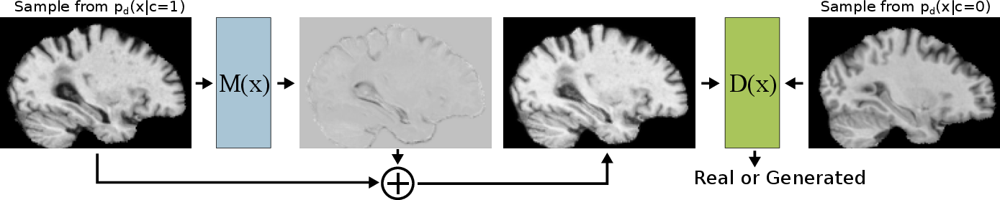
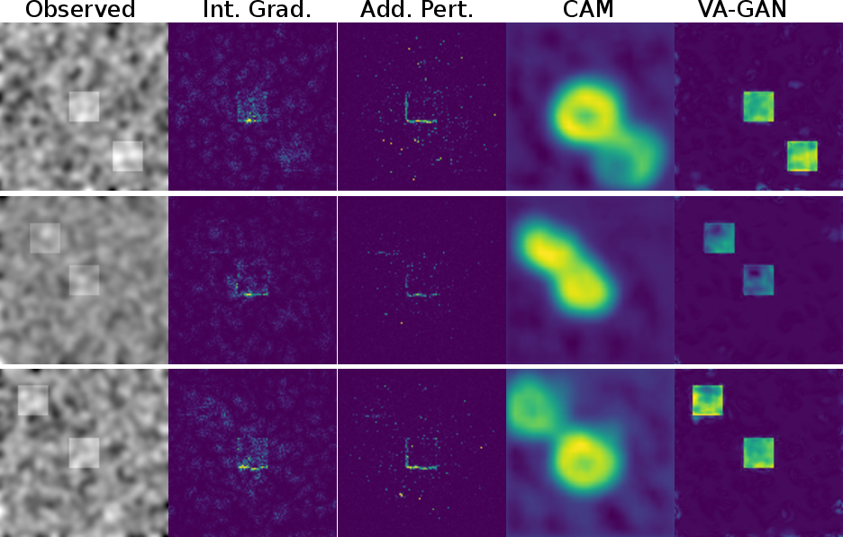
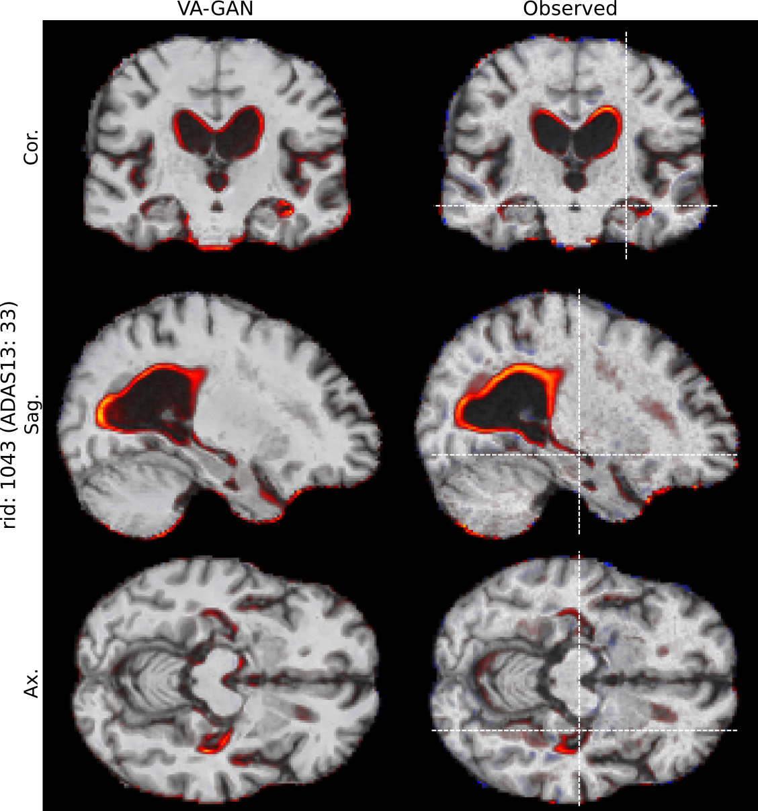

# VAGAN Code



Public tensorflow implementation for the **Visual Feature Attribution using Wasserstein GANs** method, 
which was accepted for presentation at [CVPR 2018](http://cvpr2018.thecvf.com/). 

If you find this code helpful in your research please cite the following paper:

```
@article{baumgartner2017visual,
  title={Visual Feature Attribution using Wasserstein GANs},
  author={Baumgartner, Christian F and Koch, Lisa M and Tezcan, Kerem Can and Ang, Jia Xi and Konukoglu, Ender},
  journal={arXiv preprint arXiv:1711.08998},
  year={2017}
}
```

The paper can be
found [here](https://arxiv.org/pdf/1711.08998.pdf). 

Author of this code:
- Christian F. Baumgartner ([email](mailto:baumgartner@vision.ee.ethz.ch))

## How to get the code to run:

 * Step 1: Set up a virtual environment (e.g. conda or virtualenv) with Python 3 (I used 3.4.3), and tensorflow 
 (I used version 1.2). There is a requirements.txt file so `pip install -r requirements.txt`
  should work.

Potential caveat: We had to use the dev version of skimage to allow for 3D image 
resampling of the ADNI data. Previously, we had problems to compile it with anything 
else but Python 3.4.3. However, if you don't need this function 
(which you don't on 2D data) you can simply use the normal `pip install scikit-image`.


 * Step 2: Open `config/system.py` and change the settings to match your system.

 * Step 3: Run the method by executing `python vagan_train`, which should automatically build the synthetic data, run the WGAN training, 
 and write the progress to tensorboard (`tensorboard --logdir=logdir/gan --port=8008`).
 It takes around 1h hour or 1000 steps to train the method on synthetic data. 

 * Step 4: Get some results on the test set by running: `python vagan_test_loop.py logdir/gan/synthetic_experiment` (runs without GPU)

You can also train a classifier (`classifier_train.py`) and then generate all the 
types of saliency maps discussed in the paper using the `classifier_test_saliencies.py` 
script.

## How is the code structured:

 * All scripts that can be run directly using `python <script>.py` are in the base 
 directory. 
 * All other code pertaining to VA-GAN is in the `vagan` folder. All code pertaining to the 
   classifier and the conventional saliency maps is in the folder `classifier`
 * The main code for VA-GAN can be found in `vagan/model_vagan.py`
 * All code pertaining to the different data sets is in the `data` folder
 * `tfwrapper` contains shortcuts for building layers etc. 

## Tricks for training and tuning

 * Using the `tanh` function after the generator output can make training more stable. This requires
   that the input data is scalled into the range of -1, to 1. 
 * The Wasserstein distance, i.e. negative critic loss, can be used for determining 
   how well the network is doing. Values closer to 0 usually produce better results. However, 
   the Wasserstein distance tends to be so noisy that choosing the final model on the best
   value does not work well. 
 * The best way to select a model is to look at the generated validation images in 
   tensorboard. 
 * VA-GAN does overfit when trained too long or with insufficient data. For instance the synthetic experiment with only 
   1000 data points does not produce good results. If your data set is not big enough you
   may wish to play around with dropout and weight decay for the critic and map generator.
 * The default network for the synthetic experiments (`normalnet2D`) is modelled after the 3D experiment, so
   it has an unusual layer structure. Other architectures (e.g. >1 layers per max pooling step)
   may produce better results. 
   
   
## Bugs
 
Please use the issue tracking tool to report bugs are email directly to [baumgartner@vision.ee.ethz.ch](mailto:baumgartner@vision.ee.ethz.ch). 

## Results

### Synthetic data



### ADNI brain data




